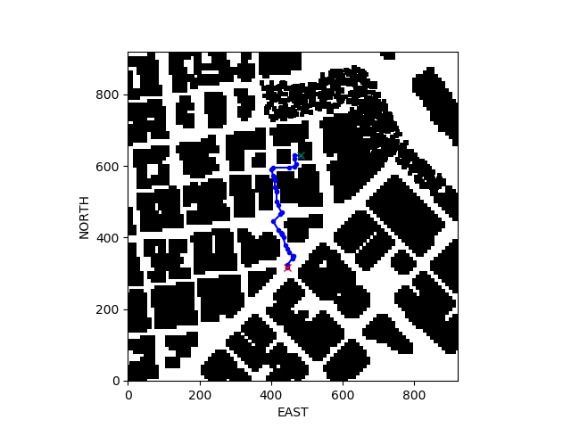

## Project: 3D Motion Planning


---


# Required Steps for a Passing Submission:
1. Load the 2.5D map in the colliders.csv file describing the environment.
2. Discretize the environment into a grid or graph representation.
3. Define the start and goal locations.
4. Perform a search using A* or other search algorithm.
5. Use a collinearity test or ray tracing method (like Bresenham) to remove unnecessary waypoints.
6. Return waypoints in local ECEF coordinates (format for `self.all_waypoints` is [N, E, altitude, heading], where the drone’s start location corresponds to [0, 0, 0, 0].
7. Write it up.
8. Congratulations!  Your Done!

## [Rubric](https://review.udacity.com/#!/rubrics/1534/view) Points
### Here I will consider the rubric points individually and describe how I addressed each point in my implementation.  

---
### Writeup / README

#### 1. Provide a Writeup / README that includes all the rubric points and how you addressed each one.  You can submit your writeup as markdown or pdf.  

You're reading it! Below I describe how I addressed each rubric point and where in my code each point is handled.

### Explain the Starter Code

#### 1. Explain the functionality of what's provided in `motion_planning.py` and `planning_utils.py`

The first striking difference between the two files is inside the state_callback function:

```python
# from backyard_flyer_solution.py state_callback
elif self.flight_state == States.ARMING:
    if self.armed:
        self.takeoff_transition()
# from motion_planning.py state_callback
elif self.flight_state == States.ARMING:
    if self.armed:
        self.plan_path()
elif self.flight_state == States.PLANNING:
    self.takeoff_transition()

```

The backyard_flyer_solution.py logic goes immediately from arming state to takeoff, whereas the motion_planning.py logic goes into a planning state before transitioning to takeoff.  This makes sense, considering that the backyard_flyer_solution.py has only dummy planning logic; i.e. fly a box pattern.  The plan_path logic in motion_planning.py is the functional implementation of the path planner for motion_planning.py, which creates the waypoints.  These waypoints are then sent to the simulator using the send_waypoints method.

As far as the functions in planning_utils.py goes, I don't really know what more there is to say:  the functions are well-commented, and have docstrings explaining what they do.  I'll provide a  brief summary of the functions and their level of interaction with other functions:

* create_grid - takes in obstacle data as east/north coordinates, drone altitude, and a safety distance and then uses that data to create an occupancy grid (1m resolution from prior context) on a desired [north_min, north_max] x [east_min, east_max] cartesian space.
* Action class - define acceptable actions from a single point in time along with an associated costs.  This cost is currently the same for all actions.  The class definition also provides functions to return the change in position, delta, and the cost af an action, cost.
* valid_actions - check whether or not an action is permissible based on an occupancy grid and the current vehicle state, i.e. current_node.  The function create_grid should be called first to generate the grid.
* a_star - execute A-star search algorithm using given an occupancy grid, a heuristic function, and start and goal points
* heuristic - simple heuristic function for speeding up A-star search by favoring expansion in certain node directions.  The heuristic used is the Euclidean distance, the L2 norm.

### Implementing Your Path Planning Algorithm

#### 1. Set your global home position
Lines 123-133 of `motion_planning.py` shows my solution:

```python
# TODO: read lat0, lon0 from colliders into floating point values
with open("colliders.csv") as f:
    lat, lon = f.readline().split(",")
lat0 = float(lat.split(" ")[-1])
lon0 = float(lon.split(" ")[-1])
# TODO: set home position to (lon0, lat0, 0)
self.set_home_position(lon0, lat0, 0)
# TODO: retrieve current global position
g_home = self.global_position
print("Current global position: {}".format(g_home)) 
```

I used the built-in python "with open(...) as f" functionality to read the first line as a string.  Based on the structure of the first line string, I was able to split that string and convert the lat and lon data as floats.  This input was then used to set the home position.

#### 2. Set your current local position

Lines 135-136 of `motion_planning.py` show my solution:

```python
# TODO: convert to current local position using global_to_local()
l_home = global_to_local(g_home, self.global_home)
```

The solution leverages the method `global_to_local` from the Drone api.  The first input is the global location of the drone and the second is the global position of the origin of the coordinate system.


#### 3. Set grid start position from local position

Lines 149-151 of `motion_planning.py` show my solution:

```python
# TODO: convert start position to current position rather than map center
grid_start = (int(np.ceil(l_home[0] - north_offset)),
              int(np.ceil(l_home[1] - east_offset)))
```

The solution takes the local position of the vehicle and translates by the offset vector computed from `colliders.csv`.

#### 4. Set grid goal position from geodetic coords

Lines 155-158 of `motion_planning.py` show my solution:

```python
# TODO: adapt to set goal as latitude / longitude position and convert
l_goal = global_to_local(self.goal, self.global_home)
grid_goal = (int(np.ceil(l_goal[0] - north_offset)),
             int(np.ceil(l_goal[1] - east_offset)))
```

`self.goal` is set from input set via the command-line:

```python
parser.add_argument('--goal', type=geo, default="-122.397450,37.792480,3.0", help='(lon, lat, alt) goal position (comma-separated)')
```

`geo` is a custom input type (see `project_utils.py` for definition).  This allows the user to set the goal position (in geodetic coordinates) from the command-line.

The `grid_goal` variable is in local coordinates, which is consistent with the `grid_start` definition above. 

#### 5. Modify A* to include diagonal motion (or replace A* altogether)

I decided to ditch the grid-based utilities provided for graph-based utilities for the following reasons:

* planned paths can get unacceptably close to obstacles, whereas graph-based methods allow construction of edges that are equidistant between obstacles
* Voronoi tesselation creates a natural, with respect to occupied vs. unoccupied space, graph structure over the grid

This solution required writing new functions.  I put these new functions in the `project_utils.py` file.  I will briefly describe each function's purpose here:

* `save_path` - takes in grid, waypoints, start, and goal positions and saves plot containing the path
* `get_object_centers` - get obstacle centers from `colliders.csv` file
* `find_open_edges` - finds connections between vertices in the graph (edges) that do not intersect with obstacles
* `create_graph_from_edges` - create a graph from edges
* `create_graph` - returns a Voronoi graph over open space given occupancy grid
* `graph_a_star` - A star search over a graph to return a path of edges from start to goal
* `closest_point` - find closest point on the graph to an input point
* `heuristic_l1` - simple heuristic function for speeding up A-star search by favoring expansion in certain node directions.  The heuristic used is the Manhattan distance, the L1 norm.
* `prune_waypoints` - prune path based on collinearity of waypoints
* `calculate_waypoint` - this method pulls all other methods together so that only a single call needs to be made in `motion_planning.py`

#### 6. Cull waypoints 
To cull collinear waypoints, I used the following logic:

```python
def prune_waypoints(wp, epsilon):
    """
    prune waypoints based on collinearity 
    args:
        wp - list of waypoints
        epsilon - pruning factor
    returns:
        list of pruned waypoints
    """
    def point(p):
        return np.array([p[0], p[1], 1.]).reshape(1, -1)

    def collinear(p1, p2, p3):
        m = np.concatenate((p1, p2, p3), 0)
        det = np.linalg.det(m)
        return float(np.abs(det)) < epsilon

    # initialize pruned path with input path
    pruned_wp = [p for p in wp]
    i = 0
    while i < len(pruned_wp) - 2:
        p1 = point(pruned_wp[i])
        p2 = point(pruned_wp[i+1])
        p3 = point(pruned_wp[i+2])

        # if the 3 points are collinear remove the middle one.
        # The 3rd point now becomes and 2nd point
        # and the check is redone with a new third point
        # on the next iteration.
        if collinear(p1, p2, p3):
            pruned_wp.remove(pruned_wp[i+1])
        else:
            i += 1
    return pruned_wp

```

The logic above is well-commented, so I will just highlight the key points here:

* start by setting the list of pruned waypoints to be the full waypoint list passed as input
* loop over sublists of three consecutive waypoints from this list
* if the middle of the three consecutive waypoints is collinear (wrt bresenham check), remove the middle waypoint

### Execute the flight
#### 1. Does it work?
Here are some changes I had to make, along with justification of why I made them:

* Modified `local_velocity_callback` to adjust transition altitude when landing.  I found that sometimes the ground level was above 0, which would cause the vehicle to be unable to transition to the disarm stage because it could not get to the 0.1 target altitude.  I now just check that the vehicle gets to between 0.97 and 1.03 times the goal altitude passed in from the command line.  This requires manual checking of geodetic altitude of ground height at the goal lat-lon, but this is not a huge deal.
* I was seeing some strange timeout errors with the simulator, so I increased the timeout value in the MavlinkConnection from 60 sec to 120 sec.  I believe this is a consequence of the time it takes to plan a path, which depends on the length of the path.

I first tried the following command:

```bash
python motion_planning.py --goal=-122.397,37.7953,3.0 
```

Which generated the following path (generated by the `save_path` function):




The path generated looks valid, which is good considering the point of this project is to plan a valid path between start and goal points.  However, running this path through the simulator proved quite challenging: the dynamics of the vehicle were erratic and, with window size S and M, the vehicle appears to crash and get stuck before completing the path.

#### First path
```bash
python motion_planning.py --goal=
```


### Double check that you've met specifications for each of the [rubric](https://review.udacity.com/#!/rubrics/1534/view) points.
  
# Extra Challenges: Real World Planning

For an extra challenge, consider implementing some of the techniques described in the "Real World Planning" lesson. You could try implementing a vehicle model to take dynamic constraints into account, or implement a replanning method to invoke if you get off course or encounter unexpected obstacles.


These scripts contain a basic planning implementation that includes...

And here's a lovely image of my results (ok this image has nothing to do with it, but it's a nice example of how to include images in your writeup!)


Here's | A | Snappy | Table
--- | --- | --- | ---
1 | `highlight` | **bold** | 7.41
2 | a | b | c
3 | *italic* | text | 403
4 | 2 | 3 | abcd
